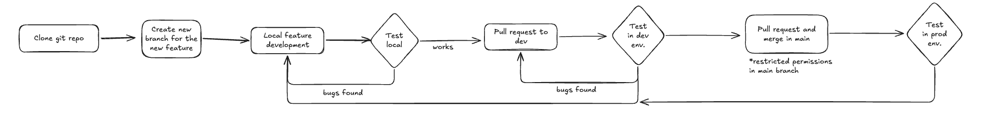

# Collaborating on FixMyMedTech

FixMyMedTech is open source. Everyone is welcome to help: fixing bugs, adding features, improving translations, writing documentation, or testing on real hospital equipment.

The project lives at
[https://github.com/FixMyMedTech/fixmymedtech-app](https://github.com/FixMyMedTech/fixmymedtech-app).

---

## 1. Reporting an issue

All work is tracked with **GitHub Issues**. Open one at
[https://github.com/FixMyMedTech/fixmymedtech-app/issues/new](https://github.com/FixMyMedTech/fixmymedtech-app/issues/new).

### Before you open an issue

* Search the existing issues (open **and** closed) — your problem may already have an answer.
* Use the applicable issue **type** (Bug report / Feature request / Question).

### Good bug reports include

* **What you did** — step-by-step reproduction.
* **What you expected** vs. **what happened**.
* **Environment** — browser/device, and which deployment
  (production `platform.fixmymedtech.org` or development `dev.fixmymedtech.org`).
* **Screenshots or a screen recording** — a picture is worth 1000 words.
* Any **log output** (browser console or `docker compose logs backend`).

### Good feature requests include

* The **problem** you are trying to solve, not just the solution you imagine.
* Who it helps and why.
* A rough proposal or mock-up if you have one.

Labels like `bug`, `feature`, `documentation`, `good first issue` help
maintainers triage. If you are not sure where something belongs, just open the
issue — we can always relabel it.

---

## 2. The collaboration flow

Contributions go through the classic fork-and-PR flow. The screenshot below is
the summary path we use:

### Where to branch from

* **Development work targets the `dev` branch.** Pushing to `dev`
  auto-deploys to the development server (`dev.fixmymedtech.org`).
* `main` auto-deploys to production, so a **maintainer** merges approved PRs
  into `main` — do not push straight to it.
* Start from an issue: “fixes #123” in the PR description links the work.

### Step by step

1. **Find or create an issue** and tell us you want to work on it.
2. **Fork** `FixMyMedTech/fixmymedtech-app` (or add a remote to your own fork).
3. **Create a branch** from `dev`, with a short descriptive name, e.g.
   `fix/avatar-menu-stale-session`.
4. **Make small, focused commits** — one logical change per commit, with a
   clear message.
5. **Run the tests and linting** before pushing (see `docs/docs/setup.md`).
6. **Open a Pull Request** to `dev` describing what changed and referencing the
   issue.
7. A maintainer **reviews**, you may be asked for tweaks, and then it is merged.

### PR checklist

* Code follows the project conventions (see `docs/docs/architecture.md`).
* No secrets, credentials, or personal data added.
* Backend changes include a migration in `infrastructure/migrations/` when the
  schema changes.
* Docs are updated when behaviour is user-visible.
* Tests still pass.

---

## 3. Join the community

We coordinate on **Discord** — questions, ideas, bug triage and announcements
happen there.

* [Join our Discord](https://discord.gg/rvNC4DKFy) 
* Development and English/French/Spanish discussion welcome.

---

## 4. Contact us

* **Project & deployments:** [fixmymedtech.org](https://fixmymedtech.org/)
* **Dev deployment:** [dev.fixmymedtech.org](https://dev.fixmymedtech.org/)
* **Production deployments:** [platform.fixmymedtech.org](https://platform.fixmymedtech.org/)
* **Email:** [email](mailto:hello@careagain.org)
  <!-- TODO: replace with the real contact address -->
* **GitHub:** [FixMyMedTech/fixmymedtech-app](https://github.com/FixMyMedTech/fixmymedtech-app)

Whether you are a biomedical engineer, a clinician, a developer, or someone
who wants to see repairs happen in LMICs — we would love to hear from you.