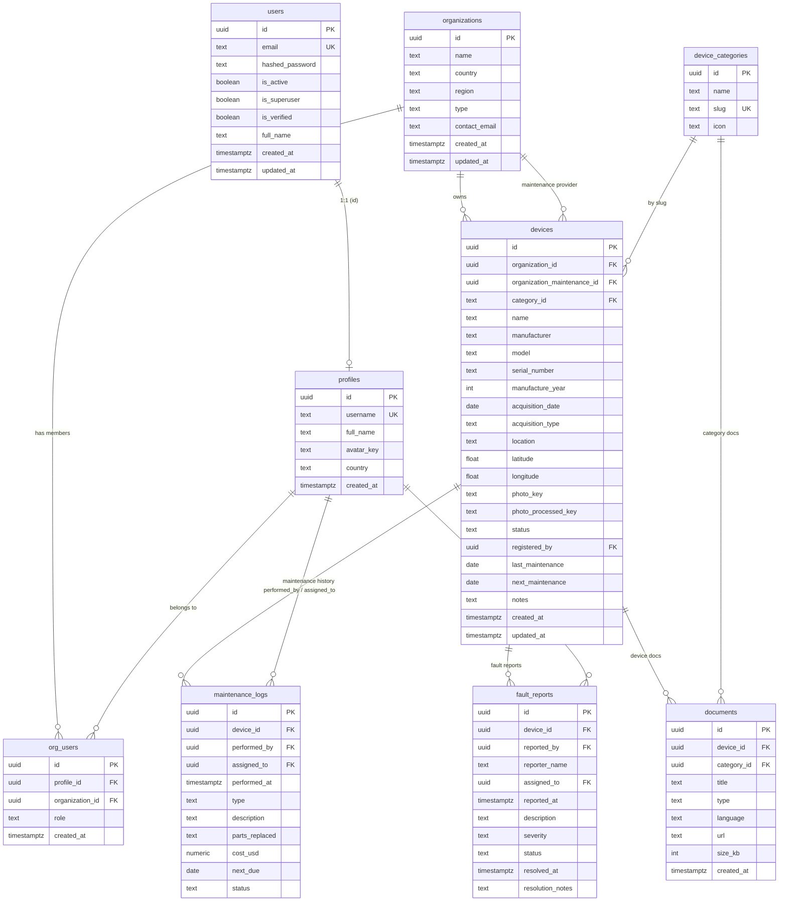

# Database Schema

All application tables live in a single PostgreSQL schema, `fixmymedtech`, and
are created/updated by the ordered SQL files in
`infrastructure/migrations/`, applied automatically at backend startup
(tracked in `fixmymedtech.schema_migrations`).

**Conventions**

- Every row uses a `UUID` primary key (default `gen_random_uuid()`), so IDs
  never collide across environments and are safe to use in public QR URLs.
- **Users vs. profiles:** authentication identity lives in `users` (managed by
  FastAPI-Users, JWTs signed with `AUTH_JWT_SECRET`). Per-user profile data
  lives in `profiles`, whose `id` mirrors `users.id` 1:1.
- **Storage:** photo/avatar/document binaries are stored in MinIO. The tables
  only keep the *object key* (e.g. `profiles/<uuid>/avatar_<hex>.jpg`).
- Timestamps use `TIMESTAMPTZ` (timezone-aware).

---

## users

Local authentication identity (FastAPI-Users / password + JWT). Supabase's
`auth.users` is **not** used.

| Column | Type | Nullable | Default | Notes |
|--------|------|----------|---------|-------|
| `id` | UUID | No (PK) | `gen_random_uuid()` | Shared 1:1 with `profiles.id` |
| `email` | TEXT | No | — | `UNIQUE`; login identifier |
| `hashed_password` | TEXT | Yes | — | bcrypt hash; empty for legacy/placeholder users |
| `is_active` | BOOLEAN | No | `TRUE` | Disabled users cannot log in |
| `is_superuser` | BOOLEAN | No | `FALSE` | Grants admin-portal access |
| `is_verified` | BOOLEAN | No | `FALSE` | Set after email verification |
| `full_name` | TEXT | Yes | — | Display name |
| `created_at` | TIMESTAMPTZ | Yes | `NOW()` | |
| `updated_at` | TIMESTAMPTZ | Yes | `NOW()` | Auto-updated on change |

---

## profiles

Per-user profile data. One row per user; `id` = `users.id`.

| Column | Type | Nullable | Default | Notes |
|--------|------|----------|---------|-------|
| `id` | UUID | No (PK, FK) | — | `FOREIGN KEY → users.id ON DELETE CASCADE` |
| `username` | TEXT | No | — | `UNIQUE`; used in URLs and UI |
| `full_name` | TEXT | Yes | — | Display name (may mirror `users.full_name`) |
| `avatar_key` | TEXT | Yes | — | MinIO key of the profile photo, e.g. `profiles/<uuid>/avatar_<hex>.jpg` |
| `country` | TEXT | Yes | — | User-submitted country (registration/profile) |
| `created_at` | TIMESTAMPTZ | Yes | `NOW()` | |

---

## organizations

Hospitals, clinics, labs, etc. that own devices.

| Column | Type | Nullable | Default | Notes |
|--------|------|----------|---------|-------|
| `id` | UUID | No (PK) | `gen_random_uuid()` | |
| `name` | TEXT | No | — | |
| `country` | TEXT | No | — | |
| `region` | TEXT | Yes | — | Region/province within country |
| `type` | TEXT | Yes | `hospital` | `CHECK` in (`hospital`, `clinic`, `health_centre`, `lab`, `engineering`) |
| `contact_email` | TEXT | Yes | — | |
| `created_at` | TIMESTAMPTZ | Yes | `NOW()` | |
| `updated_at` | TIMESTAMPTZ | Yes | `NOW()` | Auto-updated on change |

---

## org_users

Junction table linking a profile to an organization with a role. A user can
belong to several organizations with a different role in each.

| Column | Type | Nullable | Default | Notes |
|--------|------|----------|---------|-------|
| `id` | UUID | No (PK) | `gen_random_uuid()` | |
| `profile_id` | UUID | No (FK) | — | `FOREIGN KEY → profiles.id ON DELETE CASCADE` |
| `organization_id` | UUID | No (FK) | — | `FOREIGN KEY → organizations.id ON DELETE CASCADE` |
| `role` | TEXT | No | `admin` | `CHECK` in (`admin`, `technician`, `clinical_staff`, `engineering_staff`) |
| `created_at` | TIMESTAMPTZ | Yes | `NOW()` | |

`UNIQUE (profile_id, organization_id)` — one role per user per org.

---

## device_categories

Device guide categories (pre-seeded by migration `010`).

| Column | Type | Nullable | Default | Notes |
|--------|------|----------|---------|-------|
| `id` | UUID | No (PK) | `gen_random_uuid()` | |
| `name` | TEXT | No | — | Display name |
| `slug` | TEXT | No | — | `UNIQUE`; referenced by `devices.category_id` |
| `icon` | TEXT | Yes | `🏥` | Emoji shown in lists |

---

## devices

Medical equipment. All 20 pre-seeded categories exist from migration `010`.

| Column | Type | Nullable | Default | Notes |
|--------|------|----------|---------|-------|
| `id` | UUID | No (PK) | `gen_random_uuid()` | Used in public QR URL `/d/{id}` |
| `organization_id` | UUID | No (FK) | — | Owning org, `FOREIGN KEY → organizations.id` |
| `organization_maintenance_id` | UUID | No (FK) | — | Org that maintains it, `FOREIGN KEY → organizations.id` |
| `category_id` | TEXT | Yes (FK) | — | `FOREIGN KEY → device_categories.slug` |
| `name` | TEXT | No | — | |
| `manufacturer` | TEXT | Yes | — | |
| `model` | TEXT | Yes | — | |
| `serial_number` | TEXT | Yes | — | |
| `manufacture_year` | INT | Yes | — | |
| `acquisition_date` | DATE | Yes | — | |
| `acquisition_type` | TEXT | Yes | `purchased` | `CHECK` in (`purchased`, `donated`, `leased`) |
| `location` | TEXT | Yes | — | Free-form building/room |
| `latitude` | FLOAT | Yes | — | |
| `longitude` | FLOAT | Yes | — | |
| `photo_key` | TEXT | Yes | — | MinIO key of the original photo |
| `photo_processed_key` | TEXT | Yes | — | MinIO key of the processed (white-background) photo |
| `status` | TEXT | Yes | `operational` | `CHECK` in (`operational`, `maintenance`, `fault`, `decommissioned`) |
| `registered_by` | UUID | Yes (FK) | — | Profile that registered it, `FOREIGN KEY → profiles.id` |
| `last_maintenance` | DATE | Yes | — | |
| `next_maintenance` | DATE | Yes | — | Suggests follow-up |
| `notes` | TEXT | Yes | — | |
| `created_at` | TIMESTAMPTZ | Yes | `NOW()` | |
| `updated_at` | TIMESTAMPTZ | Yes | `NOW()` | Auto-updated on change |

---

## documents

Manuals, quick guides, videos, diagrams, checklists. Attached either to a
**device** or to a **category** (library-level).

| Column | Type | Nullable | Default | Notes |
|--------|------|----------|---------|-------|
| `id` | UUID | No (PK) | `gen_random_uuid()` | |
| `device_id` | UUID | Yes (FK) | — | `FOREIGN KEY → devices.id ON DELETE CASCADE`; device-specific doc |
| `category_id` | UUID | Yes (FK) | — | `FOREIGN KEY → device_categories.id`; category-level doc |
| `title` | TEXT | No | — | |
| `type` | TEXT | No | — | `CHECK` in (`manual`, `quick_guide`, `video`, `diagram`, `checklist`) |
| `language` | TEXT | Yes | `en` | |
| `url` | TEXT | No | — | Where the file/asset lives |
| `size_kb` | INT | Yes | — | |
| `created_at` | TIMESTAMPTZ | Yes | `NOW()` | |

Exactly one of `device_id` / `category_id` should be set.

---

## maintenance_logs

Preventive, corrective, or inspection records for a device.

| Column | Type | Nullable | Default | Notes |
|--------|------|----------|---------|-------|
| `id` | UUID | No (PK) | `gen_random_uuid()` | |
| `device_id` | UUID | No (FK) | — | `FOREIGN KEY → devices.id ON DELETE CASCADE` |
| `performed_by` | UUID | Yes (FK) | — | Profile that did the work, `FOREIGN KEY → profiles.id` |
| `assigned_to` | UUID | Yes (FK) | — | Profile the task is assigned to, `FOREIGN KEY → profiles.id` |
| `performed_at` | TIMESTAMPTZ | Yes | `NOW()` | |
| `type` | TEXT | No | — | `CHECK` in (`preventive`, `corrective`, `inspection`) |
| `description` | TEXT | Yes | — | |
| `parts_replaced` | TEXT | Yes | — | |
| `cost_usd` | NUMERIC(10,2) | Yes | — | |
| `next_due` | DATE | Yes | — | Next scheduled maintenance |
| `status` | TEXT | No | `open` | `CHECK` in (`open`, `in_progress`, `closed`) |

---

## fault_reports

Fault reports, typically submitted by clinical staff (often anonymously via
a public QR link).

| Column | Type | Nullable | Default | Notes |
|--------|------|----------|---------|-------|
| `id` | UUID | No (PK) | `gen_random_uuid()` | |
| `device_id` | UUID | No (FK) | — | `FOREIGN KEY → devices.id ON DELETE CASCADE` |
| `reported_by` | UUID | Yes (FK) | — | Profile that reported it, `FOREIGN KEY → profiles.id`; NULL for anonymous |
| `reporter_name` | TEXT | Yes | — | Free-text name on anonymous reports |
| `assigned_to` | UUID | Yes (FK) | — | Technician profile assigned, `FOREIGN KEY → profiles.id` |
| `reported_at` | TIMESTAMPTZ | Yes | `NOW()` | |
| `description` | TEXT | No | — | |
| `severity` | TEXT | Yes | `medium` | `CHECK` in (`low`, `medium`, `high`, `critical`) |
| `status` | TEXT | Yes | `open` | `CHECK` in (`open`, `assigned`, `in_progress`, `resolved`) |
| `resolved_at` | TIMESTAMPTZ | Yes | — | |
| `resolution_notes` | TEXT | Yes | — | |

---

## schema_migrations

Bookkeeping table used by the migration runner (`backend/migrations.py`) to
run each SQL file exactly once, in filename order.

| Column | Type | Nullable | Default | Notes |
|--------|------|----------|---------|-------|
| `name` | TEXT | No (PK) | — | Migration filename, e.g. `016_profile_country.sql` |
| `applied_at` | TIMESTAMPTZ | No | `NOW()` | When it ran |